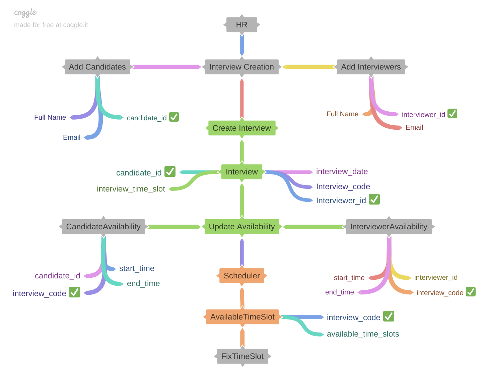

# Optimizing Interview Scheduling for HR Professionals

Streamlining interview scheduling is a complex task for HR teams. Utilizing Django, Django REST framework, and Redis for caching becomes essential for an efficient solution. These frameworks, coupled with dedicated scheduling software, significantly enhance scheduling capabilities, simplifying the management of interview schedules by integrating technology effectively.


## Mind Map



## Installation
1. Clone repository
2. Create Virtualenv & activate
    
        virtualenv venv
        source venv/bin/activate
    
3. Install the packages

        pip install -r requirement.txt
    
## Getting started

1. start the Django application 
    
        cd interview_scheduler
        python3 manage.py runserver
    
2. Start the redis server on port 6376(refer settings.py)
   
        redis-server --port 6376

# API documentation

## As a first step we need to create the interviewer and candidate,

### Create a candidate

### Request

- **Method:** POST
- **URL:** `http://127.0.0.1:8000/api/register/candidates/`
- **Headers:** No specific headers are required.
- **Body:**

  ```
  {
    "full_name": "Namith Prasad",
    "email": "namith@example.com",
    "contact": "9864565289"
  }

### Response
   
    Status Code: 201 Created
    Response Body:
    {
    "candidate_id": 76053,
    "full_name": "Namith Prasad",
    "email": "namith@example.com",
    "contact": "9864565289"
    }
    
### Create an Interviewer

### Request

- **Method:** POST
- **URL:** `http://127.0.0.1:8000/api/register/interviewers/`
- **Headers:** No specific headers are required.
- **Body:**

  ```
  {
    "full_name": "Bharath",
    "email": "bharath@example.com",
    "contact": "9188292137"
  }

### Response
   
    Status Code: 201 Created
    Response Body:
    {
    "interviewer_id": 93717,
    "full_name": "Bharath",
    "email": "bharath@example.com",
    "contact": "9188292137"
    }

### create An Interview with the details of Candidate and interviewer

### Create  Interview

### Request

- **Method:** POST
- **URL:** `http://127.0.0.1:8000/api/interview/`
- **Headers:** No specific headers are required.
- **Body:**

  ```
  {
    "interview_date": "2023-12-05",
    "role": "Django Backend developer", 
    "candidate_id": 76053, // Candidate ID
    "interviewer_id": 93717 // Interviewer ID
  }


### Response
   
    Status Code: 201 Created
    Response Body:
    {
    "interview_date": "2023-12-05",
    "role": "Django Backend developer",
    "interview_code": "72245",
    "candidate_id": 76053,
    "interviewer_id": 93717,
    "interview_time_slot": "NULL"
    }

### Now we need to obtain the availabilty of the Interviewer and Candidate

### Candidate Availability 

### Request

- **Method:** POST
- **URL:** `http://127.0.0.1:8000/api/register/availability/candidate/`
- **Headers:** No specific headers are required.
- **Body:**

  ```
  {
    "candidate_id": 76053,
    "interview_code": "72245", 
    "start_time": "09:00 AM",
    "end_time": "03:00 PM"
  }


### Response
   
    Status Code: 201 Created
    Response Body:
    {
    "candidate_id": 76053,
    "interview_code": "72245",
    "start_time": "09:00 AM",
    "end_time": "03:00 PM"
    }

### Interviewer Availability 

### Request

- **Method:** POST
- **URL:** `http://127.0.0.1:8000/api/register/availability/interviewer/`
- **Headers:** No specific headers are required.
- **Body:**

  ```
  {
    "interviewer_id": 93717,
    "interview_code": "72245",  // Replace with the appropriate interview_date ID from your data
    "start_time": "12:00 PM",
    "end_time": "03:00 PM"
  }


### Response
   
    Status Code: 201 Created
    Response Body:
    {
    "interviewer_id": 93717,
    "interview_code": "72245",
    "start_time": "12:00 PM",
    "end_time": "03:00 PM"
    }

## Now we need to obtain the available slots

### Get Availabile Slots

### Request

- **Method:** POST
- **URL:** `http://127.0.0.1:8000/api/scheduler/find-slots/76053/93717/`
- **Headers:** No specific headers are required.
- **Body:**

  ```
  {
    "interview_code": "72245"
  }


### Response
   
    Status Code: 201 Created
    Response Body:
    {
    "interview_code": "72245",
    "available_slots": "['12:00 PM , 01:00 PM', '01:00 PM , 02:00 PM', '02:00 PM , 03:00 PM']"
    }
    
> Note: I have provided the rest of the API operations in the Postman collection.
> This is in a initial stage, if you found any issues in the system design please let me know.
